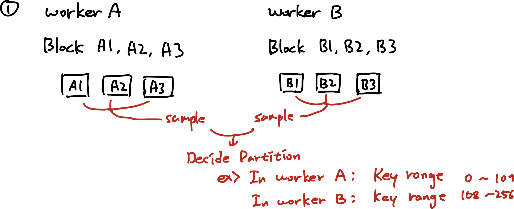

# SD Proejct : Distributed Sorting

### Input Specification

- 1 master, a fixed number of workers with their IP addresses
- Input blocks of 32MB each on each worker

### Output Specification

- An ordering of workers
- An ordering of output blocks on each worker
- Sorted output blocks (of any size)

## Baseline Algorithm

1. 각 machine의 key range를 통해 partion을 설정한다.
2. 각 block을 정렬한다.
3. 각 machine의 block들을 disk-based merge sort로 정렬한다.
    - 이 때, 정렬 결과는 partion에 따라 다른 파일에 저장되도록 한다.
4. machine의 블럭들을 적절한 partition의 machine으로 전송한다.
5. 각 machine의 tuple들을 disk-based merge sort로 정렬한다.

### Example

- Specification Assumption
    - Two workers A, B and each has three blocks.
    - Tuple key range: 0~256 for simplicity

## Optimization Point

- Well Partitioning is very important.
    - Poor partition can cause load imbalance between workers.
    - Also good partition reduces data sending overhead.
- First disk-based merge sort is not essential.
    - Just sort the each block and partition each block may be more efficient.( since multi-thread processing can improve performance when each block is partitioned independently. )

**⇒ Parition policy와 multi-processing의 개선을 염두에 두고 시스템을 디자인한다.**

## What is Needed

### **In master**

- Master는 모든 worker의 모든 block에 대한 정보를 가지고 있다.
    - 정보는 각 block의 이름, sampling으로 얻은 튜플의 분포를 포함한다.
- Master는 worker에게 다음의 작업을 명령할 수 있어야 한다.
    - worker에게 특정 블럭을 정렬하라는 명령
    - worker에게 특정 블럭을 sample하라는 명령
    - worker에게 (인자로 주어진 블럭의) 모든 튜플을 정렬하라는 명령
    - worker의 특정 블럭을 주어진 partition 기준에 따라 분할하라는 명령
    - worker의 특정 블럭(파일)을 다른 worker로 전송하라는 명령
    - 다른 worker로부터 데이터를 받아 특정 파일에 저장하라는 명령

### **In worker**

- worker의 특정 블럭을 정렬
- worker의 특정 블럭에서 지정된 개수만큼 sample
- worker의 모든 블럭을 정렬(disk-based merge sort)
- worker의 특정 블럭을 주어진 partion에 따라 분할
- worker의 특정 블럭을 다른 worker로 전송
- 다른 worker로부터 데이터를 받아 특정 파일에 저장